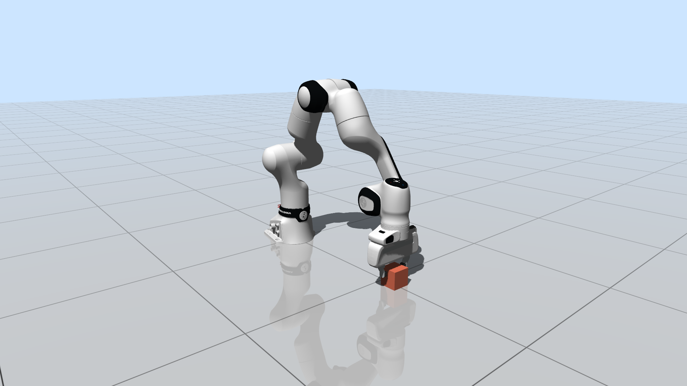
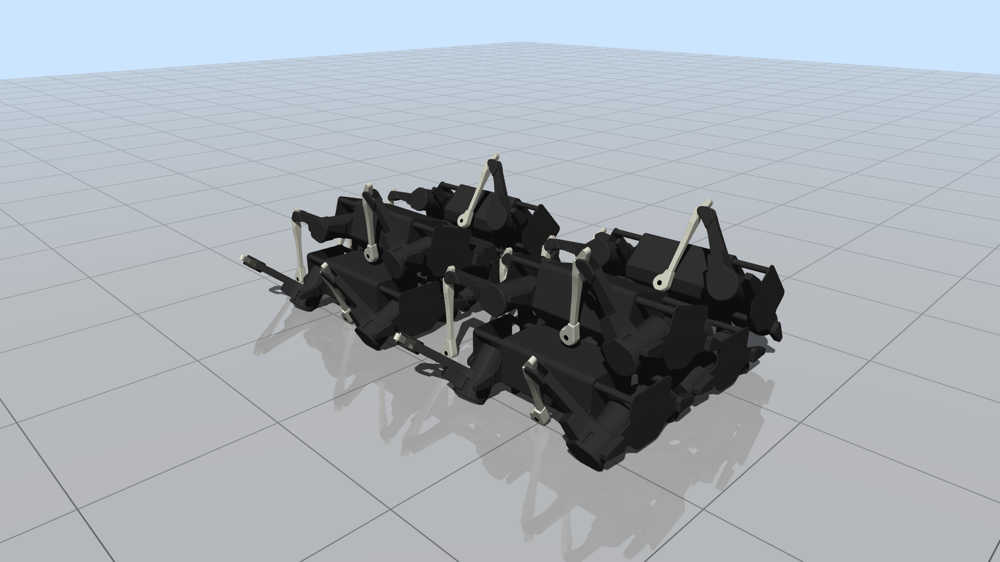
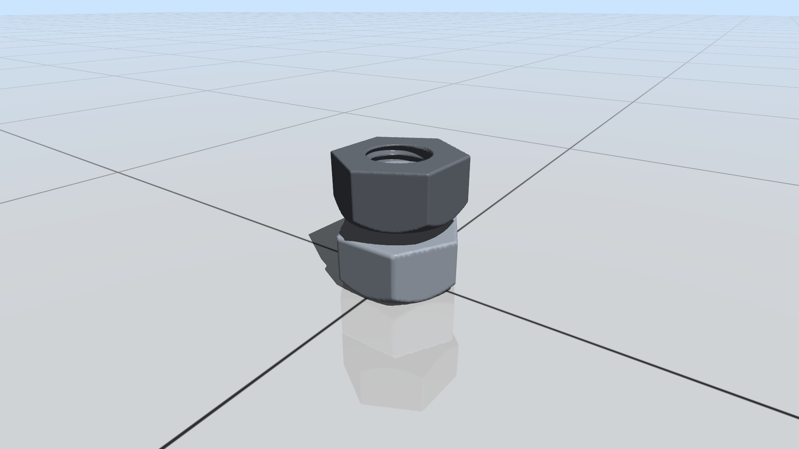
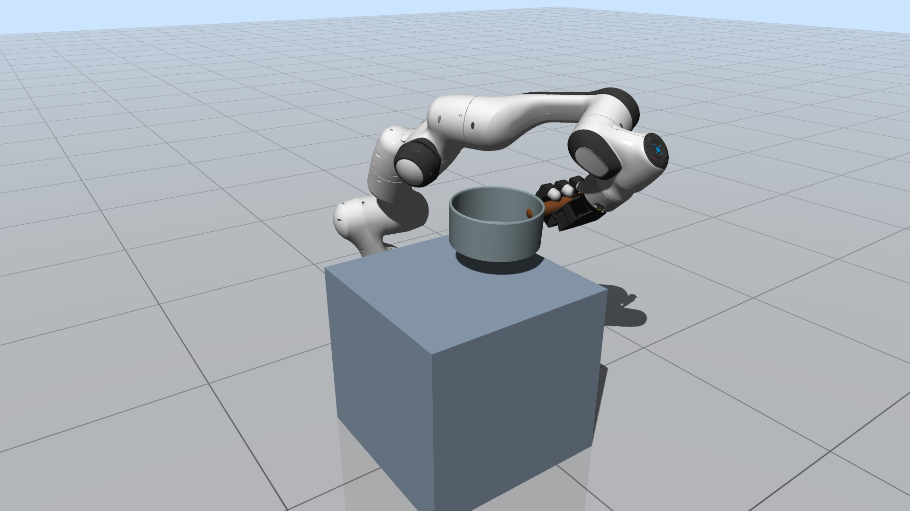
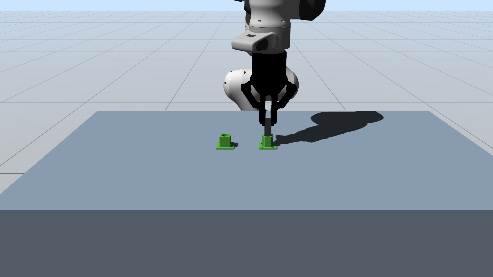
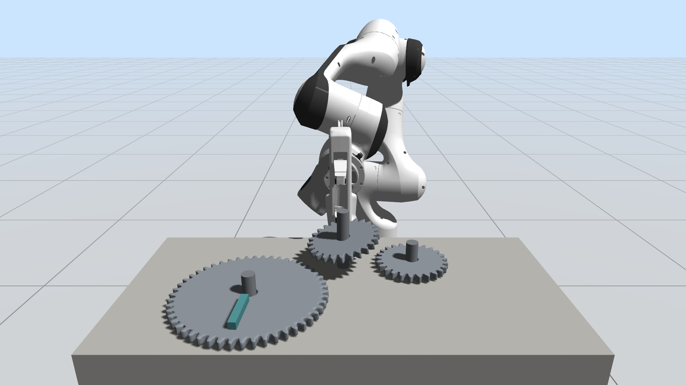
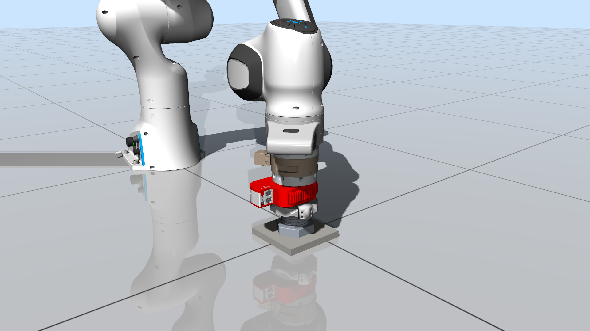

# CRISP

CRISP is a physics engine for contact-rich robotic simulation.
It is designed for complex multi-contact scenarios that require expressive geometry modeling and robust contact resolution, such as tight-tolerance insertion, grasping, gear interaction, and bolt-nut assembly.

CRISP supports primitives, convex shapes, meshes, signed distance fields (SDFs), and [differentiable support functions](https://roboticsproceedings.org/rss19/p043.html) ([DSFs](https://doi.org/10.1109/IROS58592.2024.10802286)) for flexible geometry modeling, together with robust contact solvers such as [CANAL](https://doi.org/10.1109/TRO.2025.3577410) and [SubADMM](https://doi.org/10.1109/ICRA48891.2023.10161052) for accurate dense multi-contact simulation.
This repository hosts CRISP release packages together with examples and integration materials for downstream users.

## Requirements

- CMake 3.20 or newer
- C++20 compiler (GCC 10+, Clang 10+, or MSVC 19.29+)
- [Eigen](https://eigen.tuxfamily.org/) 3.4.0 or newer

## Getting Started

By default, CMake downloads the latest CRISP release for your platform during configuration.

```bash
cmake -S . -B build
cmake --build build
```

To use the bundled Eigen dependency instead:

```bash
cmake -S . -B build -Dcrisp_use_bundled_eigen=ON
```

Release archives are available from [GitHub Releases](https://github.com/INRoL/crisp/releases):

- Windows x86_64: `crisp-X.Y.Z-windows-x86_64.zip`
- Linux x86_64: `crisp-X.Y.Z-linux-x86_64.tar.gz`
- Linux aarch64: `crisp-X.Y.Z-linux-aarch64.tar.gz`
- macOS: `crisp-X.Y.Z-macos.tar.gz`

## Examples

Each source file in `examples` is built as a separate executable.
Run examples from the repository root because asset paths are resolved relative to the current working directory.

|                                                                                                                                                                           |                                                                                                                                                                                             |
| ------------------------------------------------------------------------------------------------------------------------------------------------------------------------- | ------------------------------------------------------------------------------------------------------------------------------------------------------------------------------------------- |
| <br>`01_franka`<br>FR3 robot with a movable box                                       | <br>`02_laikago_drop`<br>Stacked quadruped drop with many contacts                   |
| <br>`03_nut_tolerance_mesh`<br>Nut tolerance case using a mesh nut | <br>`03_nut_tolerance_sdf`<br>Nut tolerance case using an SDF nut                     |
| <br>`04_pot_grasping`<br>Franka and Allegro hand pot grasping           | <br>`05_peg_in_hole`<br>Peg-in-hole manipulation with mesh and SDF geometry |
| <br>`06_gear_assembly`<br>Gear insertion and driving                             | <br>`07_bolt_nut_assembly`<br>Bolt-nut assembly with threaded SDF geometry   |

For example:

```bash
cmake --build build --target 01_franka
./build/examples/01_franka
```

With multi-config generators such as Visual Studio, build with `--config Release` and run the executable from the configuration subdirectory, for example `build/examples/Release/01_franka`.

## Roadmap

Full documentation and Python bindings are in progress for a future public release.

## Citation

If you use CRISP in your research, please cite this repository:

```bibtex
@misc{crisp2026,
  title = {{CRISP}: Contact-Rich Robotic Simulation Platform with Extensive Geometries and Contact Solvers},
  author = {{Interactive \& Networked Robotics Laboratory (INRoL)}},
  year = {2026},
  url = {https://github.com/INRoL/crisp}
}
```

Please also cite the relevant papers below when using the corresponding methods.

## Related Publications

- J. Lee, M. Lee, S. Park, J. Yun, and D. J. Lee, "[Variations of Augmented Lagrangian for Robotic Multi-Contact Simulation](https://doi.org/10.1109/TRO.2025.3577410)," IEEE Transactions on Robotics, 2025.
- J. Lee, M. Lee, and D. J. Lee, "[Modular and Parallelizable Multibody Physics Simulation via Subsystem-Based ADMM](https://doi.org/10.1109/ICRA48891.2023.10161052)," IEEE International Conference on Robotics and Automation, 2023.
- J. Lee, M. Lee, and D. J. Lee, "[Uncertain Pose Estimation during Contact Tasks Using Differentiable Contact Features](https://roboticsproceedings.org/rss19/p043.html)," Robotics: Science and Systems, 2023.
- S. An, S. Lee, J. Lee, S. Park, and D. J. Lee, "[Collision Detection between Smooth Convex Bodies via Riemannian Optimization Framework](https://doi.org/10.1109/IROS58592.2024.10802286)," IEEE/RSJ International Conference on Intelligent Robots and Systems, 2024.
