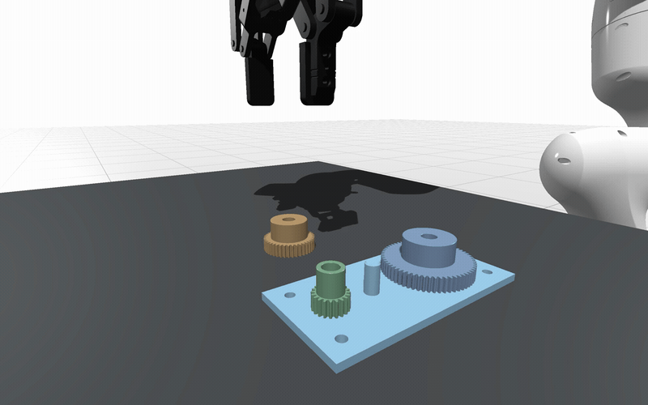

# CRISP

**A physics engine for contact-rich robotic assembly.**

CRISP uses expressive collision geometries and robust contact solvers to simulate
multibody dynamics with frictional contact.

This repository provides two assembly examples and CMake integration for the
prebuilt CRISP package.

[Project page](https://inrol.github.io/crisp/) ·
[Documentation](https://inrol.github.io/crisp/docs/overview/)



## Example scenarios

| Scenario | Description | Solver |
| --- | --- | --- |
| `peg_insertion` | Grasp, lift, and insert a round peg into a closely fitting hole. | CANAL |
| `gear_assembly` | Place a gear on its shaft, then turn it between neighboring gears. | SubADMM |

Both examples use a Franka arm with a Robotiq 2F-85 gripper and prescribed joint
targets.

## Getting started

You need CMake 3.20 or later, a C++20 compiler, and an OpenGL-capable desktop.

CMake downloads the latest CRISP package and Eigen during configuration.

```sh
git clone https://github.com/INRoL/crisp.git
cd crisp
cmake -S . -B build -DCMAKE_BUILD_TYPE=Release
cmake --build build --config Release
```

Run the examples from the repository root so that their relative paths to
`assets/` resolve correctly:

```sh
./build/examples/peg_insertion
./build/examples/gear_assembly
```

See [Installation](docs/installation.md) for other configurations and
troubleshooting, and [Examples](docs/examples.md) for model and viewer
details.

## License and citation

CRISP is available for academic and non-commercial research under the
[license terms](LICENSE). Third-party assets retain their own
[licenses](docs/licenses.md).

If you use CRISP in your research, please cite this repository and the
[relevant method papers](docs/publications.md#related-publications).

```bibtex
@misc{crisp2026,
  title = {{CRISP}: Contact-Rich Robotic Simulation Platform with Extensive Geometries and Contact Solvers},
  author = {{Interactive \& Networked Robotics Laboratory (INRoL)}},
  year = {2026},
  url = {https://github.com/INRoL/crisp}
}
```
